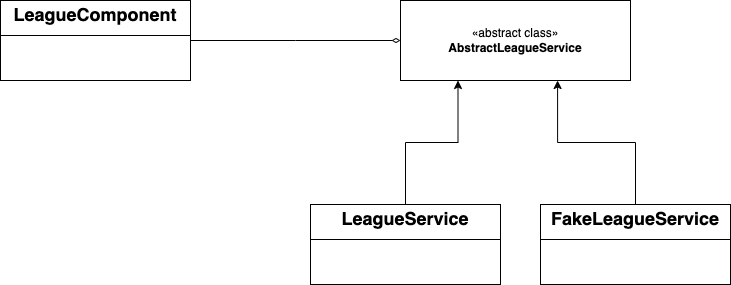
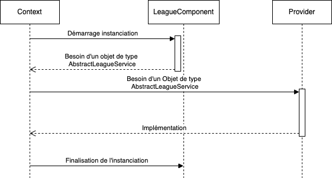
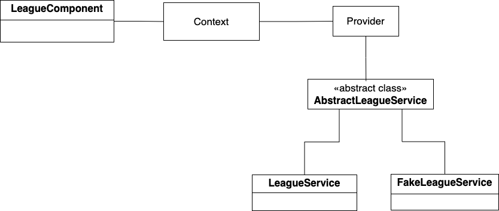

# InversionOfControl

A simple project (tutorial) to show how to setup mocked data in Angular project following best programming practices.

Watch the video here: 

## Key concept

**IOC** states that higher classes shouldn't dependent directly on lower concrete classes but on abstraction (abtract classes or interfaces). That brings flexibility to switch between implementations.

Like we are in Angular application, we created a sequence diagram to show how allows to implement that concept.

To illustrate how Angular provider can acts like a central component in a **Strategy Pattern**, we created that last diagram.

Finally, we can say that when IOC is well used, Its enforces to respect orders principles like:
* **SRP (Single Responsability Principle)**: because differents behaviors are implemented in differents classes.
* **OCP (Open Close Principle)**: Each time we need to a new behavoir, we avoid to modify existing classes, instead we create new implementation of existing that will be used later.
* **LSP (Liskov  Substitution Principle)**: We are able to switch between implementations without breaking the system.